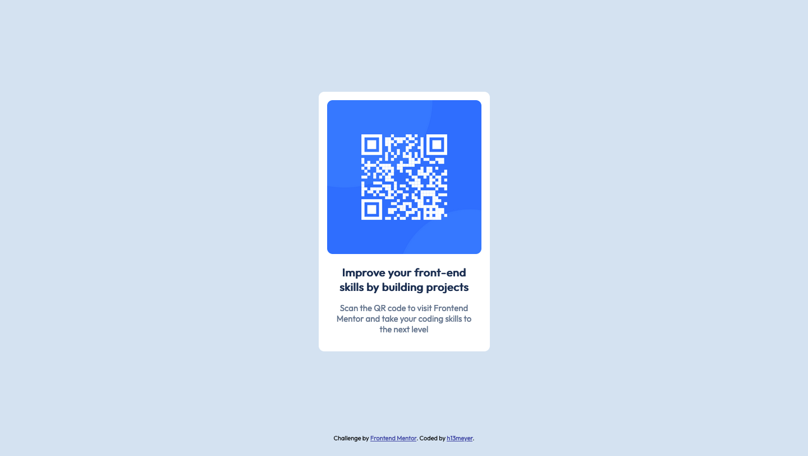

# Frontend Mentor - QR code component solution

This is a solution to the [QR code component challenge on Frontend Mentor](https://www.frontendmentor.io/challenges/qr-code-component-iux_sIO_H). Frontend Mentor challenges help you improve your coding skills by building realistic projects. 

## Table of contents

- [Overview](#overview)
  - [Screenshot](#screenshot)
  - [Links](#links)
- [My process](#my-process)
  - [Built with](#built-with)
  - [What I learned](#what-i-learned)
  - [Continued development](#continued-development)
- [Author](#author)

## Overview

### Screenshot

### Links

- Solution URL: [SOLUTION](https://www.frontendmentor.io/solutions/pure-html-css-solution-using-css-flexbox-layout-0puUlBdF1K)
- Live Site URL: [LIVE SITE](https://h13meyer.github.io/qr-code-component-main/)

## My process

### Built with

- Semantic HTML5 markup
- CSS custom properties

### What I learned

- Setting a GitHub repository as a remote repository
- Adding an extension to Visual Studio Code
- Using a non-standard Google Font
- Using CSS flexbox layout 

### Continued development

Deeper focus should be layed on responsive page layouting and precise font sizing.

## Author

- GitHub - [h13meyer](https://github.com/h13meyer)
- Frontend Mentor - [@h13meyer](https://www.frontendmentor.io/profile/h13meyer)
